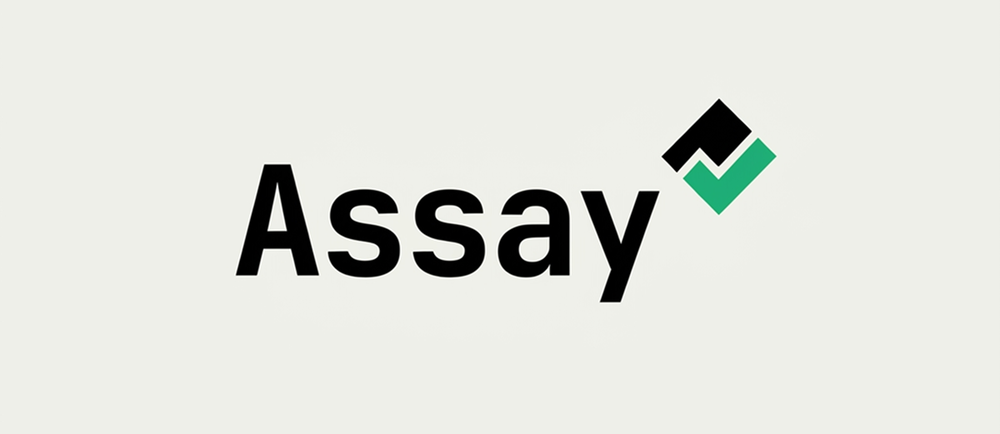

<p align="center">
  
</p>

# eyebrow

[](https://github.com/alexverify/eyebrow/actions/workflows/ci.yml)

**Supply-chain integrity for AI coding tools.** A single static binary that
discovers every skill, MCP server, plugin, hook, and rule installed across your
AI coding tools, hashes them into a lockfile, statically scans them, and detects
post-audit modification — "rug pulls" — before they bite.

> Status: Component 1 (the read-only `scan`/`verify` wedge) and Component 2 (the
> runtime MCP firewall — `wrap`, sandbox, egress proxy) are implemented. Component
> 3 ships a local, embedded dashboard with usage telemetry, fleet blast-radius,
> policy conformance, and an opt-in reputation signal; the hosted team API is
> designed but not yet built. See
> [docs/architecture/ARCHITECTURE.md](docs/architecture/ARCHITECTURE.md).

## Why

Skills, MCP servers, and hooks run with your privileges and can change after you
audit them. eyebrow gives you a committable lockfile (`eyebrowlock.json`) of
exactly what's installed and what it does, and tells you the moment any of it
changes.

## Install

**Homebrew** (macOS / Linux):

```sh
brew install alexverify/tap/eyebrow
```

**Shell installer** (no Homebrew; downloads a checksum-verified binary):

```sh
curl -fsSL https://raw.githubusercontent.com/alexverify/eyebrow/main/install.sh | sh
```

**Go users:**

```sh
go install github.com/alexverify/eyebrow/cmd/eyebrow@latest
```

**Manual:** grab a static binary from the
[releases page](https://github.com/alexverify/eyebrow/releases) and verify it:

```sh
shasum -a 256 -c --ignore-missing checksums.txt
```

Or build from source (Go 1.25+): `make build` → `./bin/eyebrow`.

## Quickstart

```sh
make install          # build + install `eyebrow` onto your PATH (zero external deps)
                      #   installs to your Go bin; if `eyebrow` isn't found, add that
                      #   dir to PATH (the command prints the exact line). Prefer not
                      #   to install? `make build` produces ./bin/eyebrow instead.

# From a project that uses Claude Code (has .mcp.json and/or .claude/skills):
eyebrow scan            # discover, hash, analyze → writes eyebrowlock.json
eyebrow list            # pretty inventory across tools
eyebrow verify          # recompute & diff vs the lockfile (rug-pull check)
eyebrow verify --ci     # strict: apply the policy gate (see Policy below)
eyebrow diff            # informational: what changed since the lockfile
eyebrow approve <id>    # mark an artifact approved in the lockfile
eyebrow sign            # sign the lockfile with your local ed25519 key
eyebrow key show        # print your public key (share it with your team)
eyebrow key trust <k>   # trust a teammate's public key
eyebrow wrap            # audit every MCP tool call via the stdio shim
eyebrow wrap --status   # what's wrapped + the real underlying commands
eyebrow unwrap          # restore the original MCP config
eyebrow install-hooks   # add usage hooks so skills/subagents get telemetry too
eyebrow dashboard       # local web dashboard: inventory, drift, usage, fleet
eyebrow fleet export    # write this machine's content-free snapshot to .eyebrow/fleet
eyebrow fleet           # team blast-radius + policy conformance from snapshots
eyebrow fleet verify    # CI gate: exit 1 if any machine is out of policy
eyebrow serve           # run the self-hostable team control plane (opt-in)
eyebrow fleet push      # submit this machine's snapshot to a control plane (--server)
eyebrow audit push      # upload this machine's audit events (--server)
eyebrow alerts          # team alerts: drift, quarantine, blocked egress (--server)
```

> Not a Go-bin-on-PATH person? `sudo make install PREFIX=/usr/local` installs to
> `/usr/local/bin`. For one-off runs without installing, `make run ARGS="scan"`.

Exit codes (stable for CI): `0` clean · `1` drift / findings over threshold ·
`2` usage error · `3` internal error.

The full solo and team workflows — policy, approvals, signing, trusted keys,
CI — are walked through in [docs/usage.md](docs/usage.md).

## Policy (CI gating)

`verify --ci` applies an optional `eyebrow.policy.json` (commit it next to the
lockfile). Absent a file, the default gate fails on any **new** high/critical
finding. Example:

```jsonc
{
  "failOnSeverity": "high",          // gate on new findings at/above this severity
  "ignoreRules": ["EXEC-PRIMITIVE"], // accepted false positives, suppressed
  "blockPublishers": ["giftshop.club"], // fail any artifact from these sources
  "blockArtifacts": ["sketchy-skill"],  // fail any artifact by name substring
  "allowPublishers": ["github.com/acme/"], // if set, fail anything not from here
  "requireApproval": true,           // fail any artifact not `eyebrow approve`d
  "requireSignedApproval": true,     // fail unless each approval is signed by a trusted key
  "requireSignature": true,          // fail unless the lockfile is validly signed
  "mcp": {                           // runtime tool rules, enforced live by `wrap`
    "servers": { "github": { "denyTools": ["delete_*"] } }
  }
}
```

With `requireSignature`, the lockfile signature is checked against a
**trusted-keys registry**: `eyebrow.trustedkeys` committed next to the
lockfile (one base64 ed25519 public key per line, optional label, `#` comments)
merged with your personal `~/.eyebrow/trusted_keys`. Each teammate shares
their key with `eyebrow key show` and registers others with
`eyebrow key trust <key> --name alice --file eyebrow.trustedkeys`. When no
registry declares any key, your own local key is trusted, so the single-user
flow needs no setup; once a registry exists it is authoritative — local
`verify --ci` behaves exactly like CI.

A committed lockfile + policy + trusted keys + the `verify --ci` exit code give
a small team "only approved, unmodified, clean, signed-by-us artifacts run
here" with no infrastructure.

### GitHub Action

```yaml
steps:
  - uses: actions/checkout@v4
  - uses: alexverify/eyebrow/action@v0.1.0
```

One tag pins the action and the checksum-verified binary it installs; see
[action/README.md](action/README.md) for inputs.

## Requirements

The binary itself has no runtime dependencies. To **pin and hash remote sources**
during a scan, eyebrow shells out to the relevant tool:

- `npm` — to resolve `npx`/npm MCP servers to an exact version + integrity and
  fetch the package code.
- `git` — to resolve git sources to a commit SHA.

These are optional: if `npm`/`git` aren't on `PATH`, that source simply can't be
pinned and is recorded as a finding instead — the scan still completes. Local
paths, inline content, and remote-URL certificate pinning need nothing extra.

## What it detects today

- **Drift / rug pulls** — any artifact whose content hash, pinned version, npm
  integrity, or remote TLS certificate changed since you locked it.
- **High-signal static findings**, mapped to the OWASP Agentic Skills Top 10:
  remote-exec pipes (`curl … | sh`), obfuscation (`eval`/`atob`), sensitive-path
  reads (`~/.ssh`, `~/.aws`, `.env`), exec primitives, npm install hooks, and
  prompt-injection / consent-bypass language in skills and rules.
- **Unverifiable sources** — unpinned or remote sources are flagged rather than
  silently trusted.

## Architecture

Pragmatic **hexagonal (ports & adapters)** in idiomatic Go: a pure, exhaustively
tested domain core (the hashing and drift logic), application use-cases that
depend only on interfaces, and swappable adapters for every external surface.
The core leans on the **Go standard library** with a single, deliberate
exception — a TOML parser for Codex configs — because a supply-chain tool should
keep its own dependency surface auditable.

Read [docs/architecture/ARCHITECTURE.md](docs/architecture/ARCHITECTURE.md) for
the package map, data flow, testing strategy, and how to extend it (adding a
tool, resolver, or analyzer is a localized change behind one interface). The
key design choices and their trade-offs are written up in
[docs/architecture/decisions.md](docs/architecture/decisions.md).

## Development

```sh
make build    # build the binary
make test     # run all tests
make check    # gofmt + vet + tests (the local CI gate)
make help     # list all tasks
```

Requires Go 1.25+. See [CONTRIBUTING.md](CONTRIBUTING.md).

## Roadmap

| Component | What | Status |
|---|---|---|
| 1 — `scan`/`verify`/lockfile | Read-only inventory, hashing, analysis, drift, signing/trust, CI Action | **implemented** (Claude Code, Cursor, Gemini, OpenCode, Codex, Windsurf, Copilot CLI) |
| 2 — `wrap` | MCP interposition supervisor, OS sandbox, egress proxy + redaction | **implemented** — shim with audit log, live tool policy, egress proxy + secret redaction, OS sandbox (Seatbelt/bwrap) |
| 3 — control plane | Policy API, audit log, approval workflow, dashboard | **in progress** — local dashboard (embedded Next.js UI, `eyebrow dashboard`) shipped: trust verdicts, capability & file-manifest drift diff (with line-level diffs when a baseline is captured), usage telemetry (MCP tool calls + skill/subagent activation hooks) + dormant-then-active detection, per-artifact timeline, reachability-aware findings, fleet blast-radius / inventory heatmap / policy conformance with an enforced CI gate (`eyebrow fleet` / `fleet verify`), and an opt-in hash-only reputation signal; a self-hostable team server (`eyebrow serve`) ingests snapshots and audit events, serves the same aggregated blast-radius, org policy / trusted-keys pull, a hosted CI gate (`fleet verify --server`), team alerts (`eyebrow alerts`), a live hash-only reputation lookup (`eyebrow reputation`), and the local dashboard's Fleet/Alerts tabs on hosted data (`eyebrow dashboard --server`) — slices 4a–4f. A centrally-hosted multi-user UI with SSO remains designed. What leaves a machine is specified in [docs/privacy.md](docs/privacy.md) |

## License

[MIT](LICENSE).
